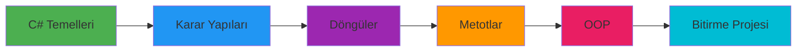

# 🎓 C# Atölye - Kapsamlı C# Eğitim Rehberi

<p align="center">
  
  
  
  
</p>

<p align="center">
  <b>C# programlama dilini sıfırdan ileri seviyeye taşıyan, uygulamalı örneklerle desteklenmiş kapsamlı bir eğitim kaynağı.</b>
</p>

---

## 📚 İçindekiler

- [Proje Hakkında](#-proje-hakkında)
- [Eğitim Müfredatı](#-eğitim-müfredatı)
- [Proje Yapısı](#️-proje-yapısı)
- [Kurulum](#-kurulum)
- [Modüller](#-modüller)
  - [1. C# Temelleri](#1️⃣-c-temelleri-csharp101)
  - [2. Karar Yapıları](#2️⃣-karar-yapıları-kararyapilari)
  - [3. Döngüler](#3️⃣-döngüler-donguler)
  - [4. Metotlar](#4️⃣-metotlar-metotlar)
  - [5. OOP (Nesne Yönelimli Programlama)](#5️⃣-oop-nesne-yönelimli-programlama)
- [Bitirme Projesi](#-bitirme-projesi)
- [Geliştirici](#-geliştirici)

---

## 🎯 Proje Hakkında

Bu repo, **C# Atölyesi** eğitim programı kapsamında hazırlanmış tüm ders materyallerini, kod örneklerini ve bitirme projesini içermektedir. Temel programlama kavramlarından Object-Oriented Programming'e (OOP) kadar geniş bir yelpazede, adım adım ilerleyen bir öğrenme deneyimi sunar.

### 🌟 Bu Eğitimde Ne Öğreneceksiniz?

| Seviye | Konular |
|--------|---------|
| 🟢 **Başlangıç** | Değişkenler, Veri Tipleri, Operatörler, Tip Dönüşümleri |
| 🟡 **Orta** | Karar Yapıları, Döngüler, Diziler, Metotlar |
| 🔴 **İleri** | OOP, Classes, Properties, Encapsulation, File I/O |
| 🏆 **Proje** | Gerçek dünya uygulaması geliştirme |

---

## 📖 Eğitim Müfredatı



---

## 🗂️ Proje Yapısı

```
C# Atölye/
│
├── 📁 _1_CSharpAtolye/           # Eğitim modülleri
│   ├── 📂 CSharp101/             # Temel kavramlar
│   ├── 📂 KararYapilari/         # If-else, switch-case
│   ├── 📂 Donguler/              # For, while, foreach
│   ├── 📂 Metotlar/              # Fonksiyonlar ve parametreler
│   └── 📂 OOP/                   # Nesne yönelimli programlama
│
├── 📁 _2_C#_Atolye_Bitirme_Projesi/  # Final projesi
│   └── 📂 csharp-bitirme-projesi/    # Araç Kiralama Sistemi
│
└── 📄 README.md                  # Bu dosya
```

---

## 🚀 Kurulum

### Gereksinimler

- [.NET SDK 8.0](https://dotnet.microsoft.com/download) veya üzeri
- [Visual Studio 2022](https://visualstudio.microsoft.com/) (önerilen) veya VS Code

### Adımlar

```bash
# 1. Repoyu klonlayın
git clone https://github.com/Cavitbatusoylu/Csharp_Atolye.git

# 2. Proje dizinine gidin
cd Csharp_Atolye

# 3. Herhangi bir modülü çalıştırın
cd _1_CSharpAtolye/CSharp101
dotnet run
```

---

## 📚 Modüller

### 1️⃣ C# Temelleri (CSharp101)

> **Amaç:** C# programlamanın temel yapı taşlarını öğrenmek

#### 📝 Kapsanan Konular

<details>
<summary><b>🔹 Değişkenler ve Veri Tipleri</b></summary>

```csharp
// Temel veri tipleri
int number = 40;
string message = "C# 14.0 is awesome!";
double pi = 3.14159;
bool isLearning = true;

// var ile tip çıkarımı
var val = 100;        // int olarak algılanır
var text = "Learning C#";  // string olarak algılanır
```

**Önemli Noktalar:**
- `int` → Tam sayılar için
- `double` → Ondalıklı sayılar için
- `string` → Metinler için
- `bool` → true/false değerleri için
- `var` → Derleyici tipi otomatik belirler

</details>

<details>
<summary><b>🔹 Tip Dönüşümleri</b></summary>

```csharp
// Implicit (Örtük) Dönüşüm - Veri kaybı yok
int intNumber = 100;
double doubleNumber = intNumber;  // int → double ✅

// Explicit (Açık) Dönüşüm - Veri kaybı olabilir
double value = 92.555;
int valInt = Convert.ToInt32(value);  // Sonuç: 93
```

**Dikkat:** Explicit dönüşümlerde ondalık kısım yuvarlanır!

</details>

<details>
<summary><b>🔹 Operatörler</b></summary>

| Kategori | Operatörler | Açıklama |
|----------|-------------|----------|
| **Aritmetik** | `+` `-` `*` `/` `%` | Matematiksel işlemler |
| **Atama** | `=` `+=` `-=` `*=` `/=` | Değer atama |
| **Karşılaştırma** | `==` `!=` `>` `<` `>=` `<=` | Koşul kontrolü |
| **Mantıksal** | `&&` `\|\|` `!` | Ve, veya, değil |

```csharp
// Atama operatörleri örneği
int x = 10;
x += 5;  // x = 15 (x = x + 5)
x -= 3;  // x = 12 (x = x - 3)
x *= 2;  // x = 24 (x = x * 2)
```

</details>

<details>
<summary><b>🔹 Kullanıcı Girdisi</b></summary>

```csharp
Console.WriteLine("Lütfen bir sayı giriniz:");
string input = Console.ReadLine();
int sayi = Convert.ToInt32(input);
Console.WriteLine($"Girdiğiniz sayı: {sayi}");
```

</details>

---

### 2️⃣ Karar Yapıları (KararYapilari)

> **Amaç:** Programın akışını koşullara göre kontrol etmeyi öğrenmek

#### 📝 Kapsanan Konular

<details>
<summary><b>🔹 If-Else Yapısı</b></summary>

```csharp
int age = 18;

if (age >= 18)
{
    Console.WriteLine("Yetişkinsiniz.");
}
else
{
    Console.WriteLine("Reşit değilsiniz.");
}
```

**Çoklu Koşul (else if):**
```csharp
int not = 85;

if (not >= 90)      Console.WriteLine("A");
else if (not >= 80) Console.WriteLine("B");
else if (not >= 70) Console.WriteLine("C");
else if (not >= 60) Console.WriteLine("D");
else                Console.WriteLine("F");
```

</details>

<details>
<summary><b>🔹 Switch-Case Yapısı</b></summary>

```csharp
int gun = 3;

switch(gun)
{
    case 1:
        Console.WriteLine("Pazartesi");
        break;
    case 2:
        Console.WriteLine("Salı");
        break;
    case 3:
        Console.WriteLine("Çarşamba");
        break;
    // ... diğer günler
    default:
        Console.WriteLine("Geçersiz gün numarası.");
        break;
}
```

**💡 İpucu:** Sabit değer karşılaştırmalarında `switch-case` daha okunabilir!

</details>

<details>
<summary><b>🔹 Scope (Kapsam) Kavramı</b></summary>

```csharp
int sayi = 10;  // Dış scope

{
    int scopeVal = 20;  // İç scope
    Console.WriteLine(scopeVal);  // ✅ Çalışır
}

Console.WriteLine(scopeVal);  // ❌ Hata! scopeVal bu alanda tanımlı değil
Console.WriteLine(sayi);      // ✅ Çalışır
```

</details>

---

### 3️⃣ Döngüler (Donguler)

> **Amaç:** Tekrarlayan işlemleri verimli şekilde gerçekleştirmeyi öğrenmek

#### 📝 Kapsanan Konular

<details>
<summary><b>🔹 For Döngüsü</b></summary>

```csharp
// 0'dan 9'a kadar yazdır
for (int i = 0; i < 10; i++)
{
    Console.WriteLine($"Sayı: {i}");
}

// İç içe döngü - Çarpım tablosu
for (int i = 1; i <= 10; i++)
{
    for (int j = 1; j <= 10; j++)
    {
        Console.WriteLine($"{i} x {j} = {i * j}");
    }
}
```

</details>

<details>
<summary><b>🔹 While ve Do-While</b></summary>

```csharp
// While - Önce koşul kontrol edilir
int counter = 0;
while (counter < 5)
{
    Console.WriteLine("Döngü: " + counter);
    counter++;
}

// Do-While - En az bir kez çalışır
int counter2 = 0;
do
{
    Console.WriteLine("Do-While: " + counter2);
    counter2++;
} while (counter2 < 3);
```

| Döngü | Ne Zaman Kullanılır? |
|-------|----------------------|
| `for` | Kaç kez döneceği belli olduğunda |
| `while` | Koşul sağlandığı sürece dönmesi gerektiğinde |
| `do-while` | En az bir kez çalışması gerektiğinde |

</details>

<details>
<summary><b>🔹 Foreach Döngüsü</b></summary>

```csharp
// Dizi üzerinde gezinme
int[] sayilar = { 1, 2, 3, 4, 5 };
foreach (int sayi in sayilar)
{
    Console.WriteLine(sayi);
}

// String karakterleri üzerinde gezinme
string kelime = "Merhaba";
foreach (char harf in kelime)
{
    Console.WriteLine(harf);
}
```

</details>

<details>
<summary><b>🔹 Break ve Continue</b></summary>

```csharp
// break - Döngüyü tamamen sonlandırır
for (int i = 0; i < 10; i++)
{
    if (i == 5) break;
    Console.WriteLine(i);  // 0, 1, 2, 3, 4 yazdırır
}

// continue - Mevcut iterasyonu atlar
for (int i = 0; i < 10; i++)
{
    if (i == 5) continue;
    Console.WriteLine(i);  // 5 hariç hepsini yazdırır
}
```

</details>

---

### 4️⃣ Metotlar (Metotlar)

> **Amaç:** Kodun modülerliğini ve yeniden kullanılabilirliğini sağlamak

#### 📝 Kapsanan Konular

<details>
<summary><b>🔹 Void Metotlar (Değer Döndürmeyen)</b></summary>

```csharp
// Parametresiz metot
static void Selamla()
{
    Console.WriteLine("Merhaba!");
}

// Parametreli metot
static void ToplaVeYazdir(int a, int b)
{
    int sonuc = a + b;
    Console.WriteLine("Toplam: " + sonuc);
}

// Kullanım
Selamla();
ToplaVeYazdir(4, 6);
```

</details>

<details>
<summary><b>🔹 Değer Döndüren Metotlar</b></summary>

```csharp
static int Topla(int a, int b)
{
    return a + b;
}

// Kullanım
int sonuc = Topla(3, 5);
Console.WriteLine("Sonuç: " + sonuc);  // Sonuç: 8
```

**return ifadesi:**
- Metodu sonlandırır
- Çağrıldığı yere değer döndürür

</details>

<details>
<summary><b>🔹 ref ve out Parametreler</b></summary>

```csharp
// ref - Referans ile geçirme (değişken önceden değer almış olmalı)
static void Degistir(ref int deger)
{
    deger = 100;
}

int sayi = 10;
Degistir(ref sayi);
Console.WriteLine(sayi);  // 100

// out - Birden fazla değer döndürme
static float CemberHesapla(float yariCap, out float cevre, out float alan)
{
    cevre = 2 * 3.14f * yariCap;
    alan = 3.14f * yariCap * yariCap;
    return alan;
}
```

</details>

<details>
<summary><b>🔹 params Parametresi</b></summary>

```csharp
// Değişken sayıda parametre alma
static int ToplaHepsini(params int[] sayilar)
{
    int toplam = 0;
    foreach (int sayi in sayilar)
    {
        toplam += sayi;
    }
    return toplam;
}

// Kullanım
int sonuc = ToplaHepsini(1, 2, 3, 4, 5);  // 15
int sonuc2 = ToplaHepsini(10, 20);         // 30
```

</details>

<details>
<summary><b>🔹 Recursive (Özyinelemeli) Metotlar</b></summary>

```csharp
// Faktöriyel hesaplama
static int Faktoriyel(int n)
{
    if (n == 0 || n == 1)
        return 1;
    return n * Faktoriyel(n - 1);
}

// 5! = 5 * 4 * 3 * 2 * 1 = 120
Console.WriteLine(Faktoriyel(5));
```

</details>

---

### 5️⃣ OOP (Nesne Yönelimli Programlama)

> **Amaç:** Modern yazılım geliştirmede temel olan OOP prensiplerini öğrenmek

#### 📝 Kapsanan Konular

<details>
<summary><b>🔹 Class (Sınıf) ve Object (Nesne)</b></summary>

```csharp
// Sınıf tanımı
class Araba
{
    public string Marka;
    public string Model;
}

// Nesne oluşturma
Araba araba = new Araba();
araba.Marka = "Toyota";
araba.Model = "Corolla";
```

</details>

<details>
<summary><b>🔹 Encapsulation (Kapsülleme)</b></summary>

```csharp
class Araba
{
    // Private field - dışarıdan erişilemez
    private string marka;
    
    // Public property - kontrollü erişim
    public string Marka
    {
        get { return marka; }
        set { marka = value; }
    }
    
    // Auto-property - kısa yazım
    public string Model { get; set; }
}
```

**Neden Kapsülleme?**
- ✅ Veri güvenliği sağlar
- ✅ Doğrulama (validation) eklemeye olanak tanır
- ✅ İç implementasyonu gizler

</details>

<details>
<summary><b>🔹 Properties (Özellikler)</b></summary>

```csharp
class Ogrenci
{
    private int yas;
    
    // Full property - validasyon ile
    public int Yas
    {
        get { return yas; }
        set
        {
            if (value >= 0 && value <= 120)
                yas = value;
        }
    }
    
    // Auto-property
    public string Ad { get; set; }
    
    // Expression-bodied property
    public string Bilgi => $"{Ad}, {Yas} yaşında";
}
```

</details>

---

## 🏆 Bitirme Projesi

### 🚗 Akıllı Araç Kiralama Rezervasyon Sistemi

Eğitim boyunca öğrenilen tüm kavramların uygulandığı gerçek dünya projesi.

#### ✨ Proje Özellikleri

| Özellik | Açıklama |
|---------|----------|
| 🚙 Araç Yönetimi | Filo listeleme, müsaitlik sorgulama |
| 📝 Rezervasyon | CRUD işlemleri, günlük/saatlik kiralama |
| 📊 Raporlama | Gelir analizi, en çok kiralanan araç |
| 💾 Veri Kalıcılığı | TXT ve JSON formatında kayıt |

#### 🔗 Uygulanan Kavramlar

```
✅ Object-Oriented Programming (OOP)
✅ Static class ve static method kullanımı
✅ Properties ve auto-properties
✅ LINQ sorguları
✅ File I/O işlemleri
✅ Exception handling
✅ DateTime işlemleri
✅ String formatting
```

#### 📁 Proje Dosya Yapısı

```
csharp-bitirme-projesi/
├── Program.cs           # Ana uygulama ve menü
├── Arac.cs              # Araç entity sınıfı
├── AracManager.cs       # Araç yönetim işlemleri
├── Rezervasyon.cs       # Rezervasyon entity sınıfı
├── RezervasyonManager.cs # İş mantığı ve raporlama
└── DosyaManager.cs      # Dosya okuma/yazma
```

👉 Detaylı bilgi için: [Bitirme Projesi README](_2_C%23_Atolye_Bitirme_Projesi/README.md)

---

## 📈 Öğrenme Yol Haritası

```
Hafta 1-2: C# Temelleri
    └── Değişkenler, Operatörler, Tip Dönüşümleri
    
Hafta 3: Karar Yapıları
    └── if-else, switch-case, Scope
    
Hafta 4: Döngüler
    └── for, while, foreach, break/continue
    
Hafta 5: Metotlar
    └── void, return, ref, out, params, recursion
    
Hafta 6-7: OOP
    └── Classes, Objects, Properties, Encapsulation
    
Hafta 8: Bitirme Projesi
    └── Gerçek dünya uygulaması geliştirme
```

---

## 🛠️ Kullanılan Teknolojiler

- **Dil:** C# 12.0
- **Framework:** .NET 8.0
- **IDE:** Visual Studio 2022
- **Versiyon Kontrolü:** Git & GitHub

---

## 👨‍💻 Geliştirici

**Cavit Batu Soylu**

<p align="left">
  <a href="https://github.com/Cavitbatusoylu">
    
  </a>
  <a href="https://www.linkedin.com/in/cavit-batu-soylu/">
    
  </a>
</p>

---

## 📄 Lisans

Bu proje eğitim amaçlı oluşturulmuştur ve açık kaynak olarak paylaşılmaktadır.

---

<p align="center">
  <b>⭐ Bu repo işinize yaradıysa yıldız vermeyi unutmayın!</b>
</p>

<p align="center">
  <i>Made with ❤️ for learning C#</i>
</p>
